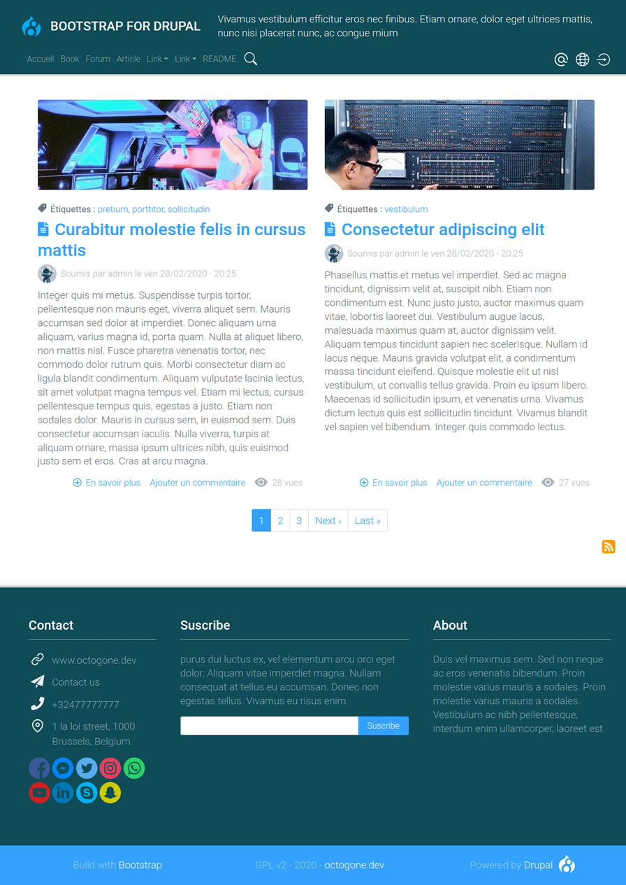
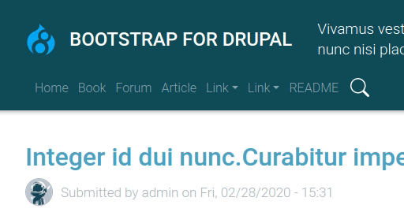
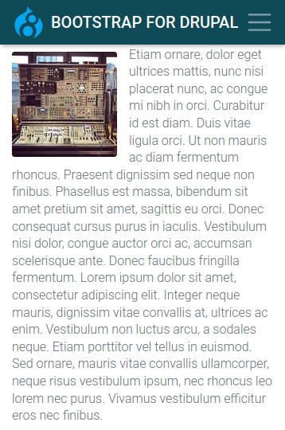

BOOTSTRAP FOR DRUPAL
============

CONTENTS OF THIS FILE
============

 * INTRODUCTION
 * NOTES
 * FEATURES
 * INSTALLATION
 * CONFIGURATION
 * CREATE CONTENT
 * BETTER ADMINISTRATION EXPERIENCE
 * SUGGESTED MODULES
 * FOR DEVELOPERS
 * FUTUR DEVELOPMENTS
 * REQUIREMENTS

INTRODUCTION
======

This project aims to provide a Drupal theme fully integrated into [Bootstrap 4][9].

This theme aims to provide users with **the best possible experience out
 of the box**, right after Drupal installation: All native Drupal blocks
  and menus are placed and stylized along with all native pages and forms.

This theme provides an advanced main navigation for desktop and mobile with a
dynamic search bar, see it in action in the **animated gif on the right
hand side**.
It is a Bootstrap 4 base solution for developers with SCSS files provided.

This theme is created by [OCTOGONE.DEV](http://www.octogone.dev)

[][8]

[][7]

## SCREENSHOT


NOTES
======

**Before updating from 8.x-1.x to 8.x-2.x., create an image style named "wide"
(600x200, scale and crop). Or update and Uninstall and reinstall the theme
but that way you will have to replace the blocks.**

* Windows Edge V18 is not supported (it does not support **mask** CSS
  properties)
, only Edge +V79 is supported.
* Bootstrap Tooltips, popover and modal might not work when logged in
* This version is built with  Bootstrap v4.4.1

## COMPARISON WITH THE MAIN THEMES BASED ON BOOTSTRAP

[Bootstrap](https://www.drupal.org/project/bootstrap)  is based on Bootstrap 3,
this theme on bootstrap 4.  It does not offer a "ready to use" solution as
this theme does.

[Barrio](https://www.drupal.org/project/bootstrap_barrio) offers a advanced
configuration in the theme settings of the Bootstrap 4 components/layout and
color/font. This may be out of reach for normal users and also a constraint
for developers who want to have total control over front-end development with
only the Twig templates and SCSS files as this theme offers. It does not offer
a "ready to use" solution as this theme does.

FEATURES
======

## ADVANCED NAVIGATION
 * Sticky navbar - Admin Toolbar compatible
 * dynamic search bar
 * Animated dropdowns
 * mobile menu with smooth opening
 *  Icons for: account, contact, language menu, email, login/logout
 * Language menu with flag (fr, en, es, de, nl, it, pt-pt, pt-br, ru)

 Desktop Menu            |  Mobile menu
:-------------------------:|:-------------------------:
 | 

## OTHERS
 * Responsive branding header with Logo, slogan and site name
 * Responsive footer and sub footer each with three regions
 * Aside column sticky
 * All native pages are stylized
 * Multilingual support
 * Comments are stylized
 * Forums are stylized [Demo][1] and responsive
 * Books are stylized [Demo][2]
 * All forms are stylized
 * Print version

INSTALLATION
======

Extract "Bootstrap for Drupal" theme folder into **/themes/contrib** of your
[Drupal 8 installation](https://www.drupal.org/docs/8/install) and go to
`/admin/appearance/settings` to set it as the **default theme**.

CONFIGURATION
==========

All native Drupal blocks and menus are placed and stylized right after
installation and the website is immediately usable. You only have to create
 the content!

## LOGO
  The maximum height of the logo in the header is **40px**. To change the
  logo go to `/admin/appearance/settings/bootstrap_for_drupal` and un-tick
  **Use the logo supplied by the theme** to upload your own.

## SLOGAN
  The maximum length of the slogan is 256 characters

## HOME PAGE
  The image style of the content type article indexed in the frontpage is
  defined is the twig template `node--view--frontpage.html.twig`.  

## MULTILINGUAL SUPPORT
   To activate the language menu, go to the module page `/admin/modules` and
   activate the **language module** in the multilingual section. Go to
   `/admin/config/regional/language` to add a language. The language menu
   will automatically be added to the main navigation after the module
   activation and the menu populated with the proper flags.
   **Configured language icons** : en, fr, de, it, es, nl, ru, pt-pt, pt-br.

## LIST OF CONTACT TYPES (MAIL, PHONE, ETC..)
   The first footer region is configured to contain a **list of contact types**
   (mail, phone, etc..); it will automatically add the icons to a list (ul).
   You have the possibility to copy the code provided in the **HTML** folder,
   or to create a list yourself.

  Order of the links:
  * Link
  * Email
  * Phone
  * Address

###  CREATE AND PLACE THE CUSTOM BLOCK
  1. Create a block at `/admin/structure/block/block-content`
  2. Place the block at `/admin/structure/block` in the region
  **Footer - left box**.

## SOCIAL ICON
   Social icon HTML code (svg) is provided in the **HTML** folder.

## BOOTSTRAP MODAL
   Modal code is available **HTML** folder. Copy the
   **modal box** code to a custom block that you create with full html text
   format, and place the created block in the **modal region**. Specify the page
   where it is displayed in the block settings, DO NOT display the title of the
   block. Finally, copy the **modal button code** in the corresponding page.

## ERROR 403 & 404 PAGE
Find the HTML code for those page in the HTML folder. You should desactivate the
display of the block title for those page.

## VIEW CONTENT HITS
To display the view counter on the public website, you have to activate the
**core** module statistics at `/admin/modules` and grant permission to
anonymous to **View content hits** at the page`/admin/people/permissions`.

CREATE CONTENT
======

Visit the page [Administering a Drupal 8 site][3]
for more information. Note that the **text in the summary field** is the text
used by the home page to list content.

## MAIN NAVIGATION
1. Create menu items in the main navigation: go to
 `/admin/structure/menu/manage/main`.
2. Create a dropdown menu: create a child menu item by holding/sliding the
cross of a menu item to the right. **Only one level is supported**.

**Note:** You do not have to check **show as expanded** for parent links;
this is automatic. The first level link (the parent) will not be used.
Bootstrap makes it the dropdown trigger automatically. Thus put in that
link the target **#** - for example.

BETTER ADMINISTRATION EXPERIENCE
========================

The **Adminimal suite** is the ultimate administration theming solution for
Drupal. You simply have to activate the modules to make it work! It makes
Drupal admin interface much more user friendly. This theme is
compatible with the Admin toolbar; the sticky bar will position properly when
one or both of the admin bars are active, in desktop or mobile screen.	Go to
`/admin/appearance` and in the **Administration theme** (end of the page)
choose Adminimal.

**List of modules to install:**

* [Admin Toolbar][4]
* [Adminimal Admin Toolbar][5]
* [Adminimal theme][6]

SUGGESTED MODULES
============

This is a list of simple modules allowing you to greatly enhance the drupal
user experience.

## PATHAUTO

[pathauto](https://www.drupal.org/project/pathauto) will automatically
generate URL/path aliases for various kinds of content.
Below are the patterns to use for the different types of entities:

Content: article

`[node:content-type:name]/[node:title]`

Content: page

`[node:title]`

Content: Book

`book/[node:book:parents:join-path]/[node:title]`

Content: forum

`forum/[node:taxonomy_forums:entity:parents:join-path]/[node:taxonomy_forums:entity:name]/[node:title]`

Taxonomy

`[term:vocabulary]/[term:parents:join-path]/[term:name]`

Media

`media/[media:bundle]/[media:name]`

user

`user/[user:account-name]`

## FORM PLACEHOLDER
  [form_placeholder](https://www.drupal.org/project/form_placeholder)
  transforms forms labels into placeholders. It makes the form
  clearer and more user friendly.

  This is the list of IDs to add in the text area **Include text fields matching
  the pattern** of the config page
  `/admin/config/user-interface/form-placeholder`:
  ```
  #edit-mail
  #edit-message-0-value
  #edit-name
  #edit-subject-0-value
  #edit-pass
  #edit-comment-body-0-value
  ```

## FOCAL POINT
[Focal point](https://www.drupal.org/project/focal_point) allows you to
specify the portion of an image that is most important. This information can
be used when the image is cropped or cropped and scaled.

## HONEYPOT
  [honeypot](https://www.drupal.org/project/honeypot)
  protect your form from spam without punishing the user with a captcha.

## REDIRECT AFTER LOGIN
  [redirect_after_login](https://www.drupal.org/project/redirect_after_login)
  is a simple module allowing you to change the redirection to the user's page
  after login.


## ALLOWED FORMATS
[allowed_formats](https://www.drupal.org/project/allowed_formats) allow to
remove the **text formats guidelines** below the forms.

FOR DEVELOPERS
============

 * All SCSS files are provided
 * Custom bootstrap variables overwrite SCSS file
 * Only SVG icons with mask attribute are used, allowing for:
   color/size/position/transition with CSS. Note that **mask** CSS
   properties are not supported by Edge V18. No use of icon frameworks
   (like fontawesome - weight 2MB), all svg icons are local and thus lighter
   (60kb in total). Maximum bootstrap integration into the theme
 * Gulp file is provided and SCCS files are configured to be built
   with node.js

## BOOTSTRAP 4 FEATURES
  The theme is totally built with the Bootstrap grid system and maximum usage
   of bootstrap classes.

  List of Bootstrap components integrated  :
  * status message
  * pager
  * breadcrumbs
  * tooltips, popover, modal, carousel (check javascript for target)
  * form (custom style) : submit, input, checkbox, select, radio, textfield

FUTUR DEVELOPEMENT
============

* Error 403/404 page
* Multi-color / font combinations in the theme configuration with one click
(in same layout).
* Drupal 9 porting.
* Payed theme with more features:
  - Complete list of HTML typography elements stylized in a template page
  - Static and dynamic bootstrap components with one click copy code
  - Static and dynamic custom components with one click copy code
  - Dynamic scrollspy with auto-generated menu (javascript)
  - Up / down scroll button (javascript)
  - Two more animation effects for the search bar
  - Page that lists all bootstrap classes
  - All Drupal languages / flags supported for the language selection menu

REQUIREMENTS
======

No requirements.

[1]:https://bootstrap-for-drupal.octogone.dev/forum
[2]:https://bootstrap-for-drupal.octogone.dev/node/12
[3]:https://www.drupal.org/docs/8/administering-a-drupal-8-site/managing-content
[4]:https://www.drupal.org/project/admin_toolbar
[5]:https://www.drupal.org/project/adminimal_admin_toolbar
[6]:https://www.drupal.org/project/adminimal_theme
[7]:https://bootstrap-for-drupal.octogone.dev/
[8]:https://www.buymeacoffee.com/octogonedev
[9]:https://getbootstrap.com/
